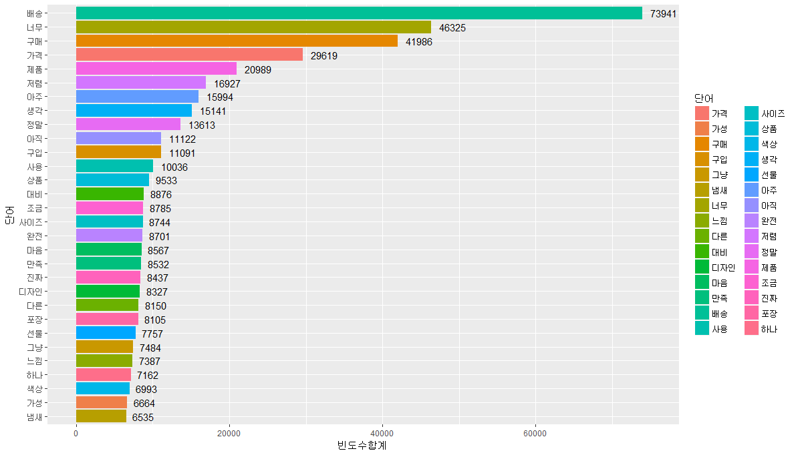
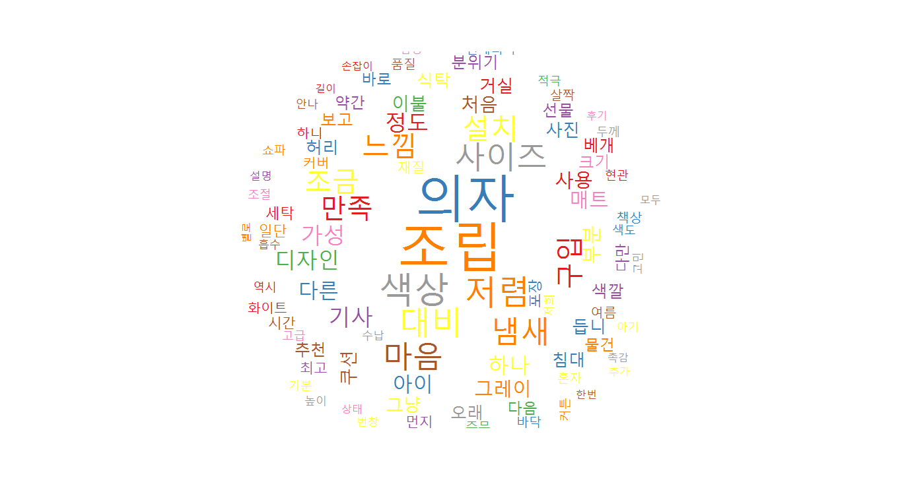

<h1 align="center"> 네이버 스마트 스토어 구매평을 통한 소비자 반응 분석</h1>

중소상공인의 대표 온라인 플랫폼 네이버 스마트 스토어 (사진 출처: 네이버 스마트 스토어)

<a href="http://www.yonhapnews.co.kr/bulletin/2018/03/09/0200000000AKR20180309143000033.HTML?input=1195m" target="_blank">10명 중 9명이 이용중인 온라인 쇼핑의 중심~!</a>

## 1. 스마스 스토어 제품 카테고리 별로 소비자 반응을 분석했어요(총 9개 카테고리)

- Twitter 명사 추출을 통한 소비자 구매평의 핵심 KEY 도출
- KOSAC 감성사전을 이용한 구매평 속의 긍정/부정/중립의 언어표현 비율 분석 (소비자 감정분석)

- 예시) 네이버 스마스 스토어 TOP100 상품 구매평에 담긴 구매평 핵심 KEY 워드

- 예시) 리빙분야의 "만족" 구매평을 남긴 소비자 반응 워드 크라우드 

## 2. 직접 네이버 스토어를 분석해 보세요

- 스마트 스토어 운영자가 제품 URL을 기입하면 자동으로 분석해주도록 APP 설계
- 워드크라우드, 막대그래프로 소비자 댓글 분석 결과 출력

### 사용한 파일

- fianl_NaverCrawling.py
- final_TwitterNoun.py
- fianl_NaiveBayseClassifier.py
- fianl_NaiveBayseClassifier.py
- fianl_NaiveBayseClassifier.py
- fianl_NaiveBayseClassifier.py
- fianl_NaiveBayseClassifier.py
- fianl_NaiveBayseClassifier.py

## 라이센스

본 프로젝트는 깃허브 출처 공개에 한하여 배포 가능합니다.